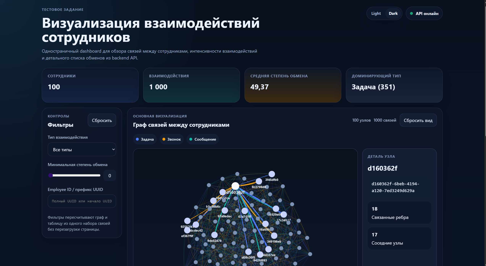
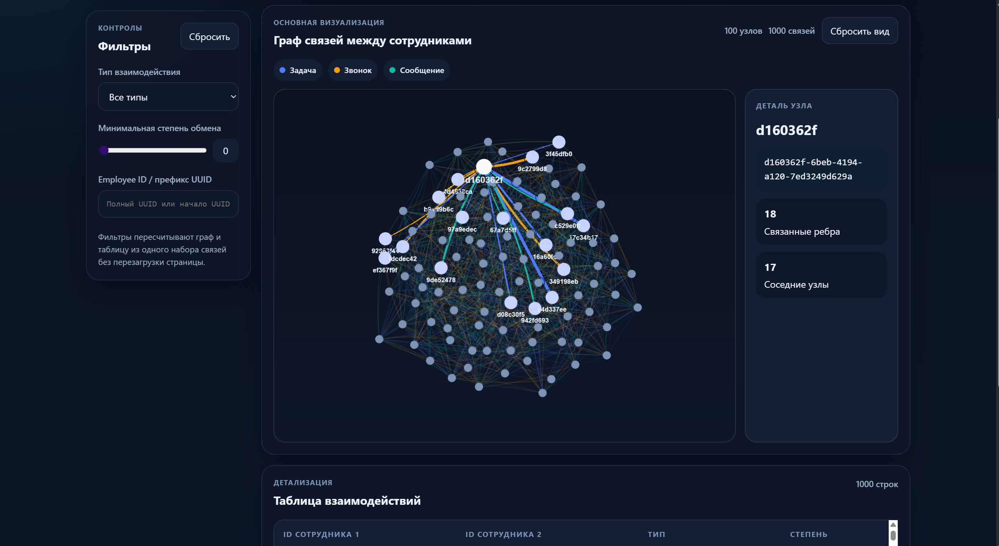
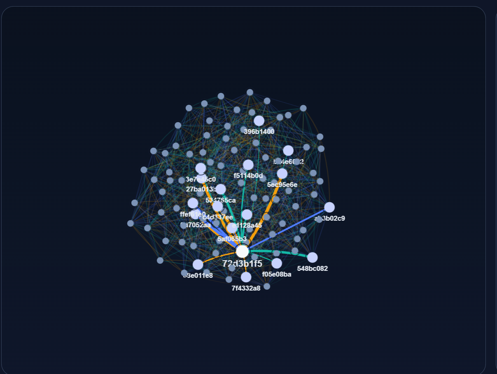
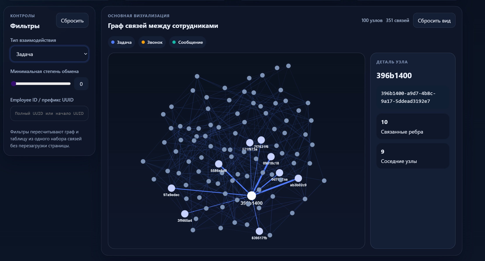
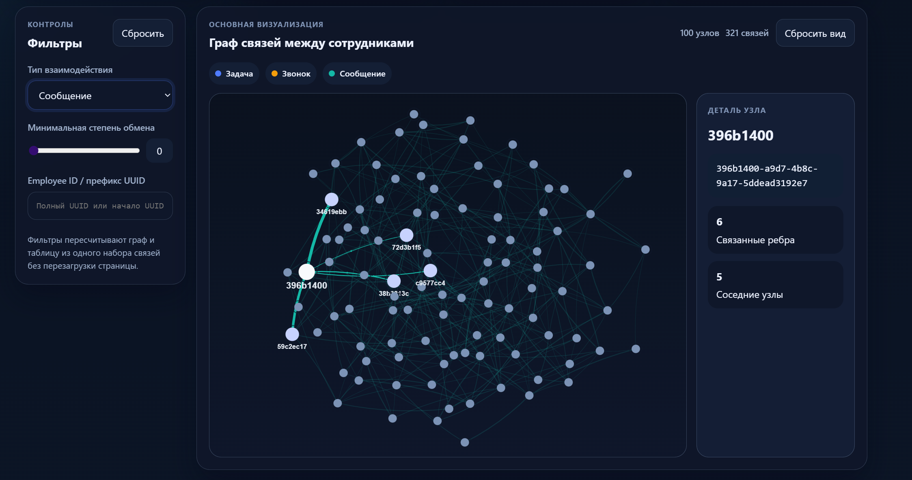
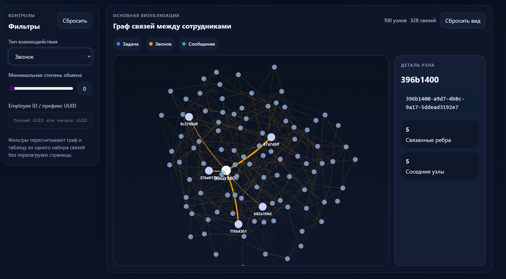
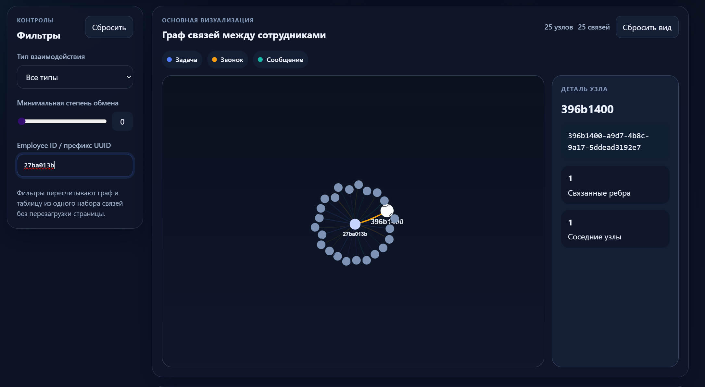
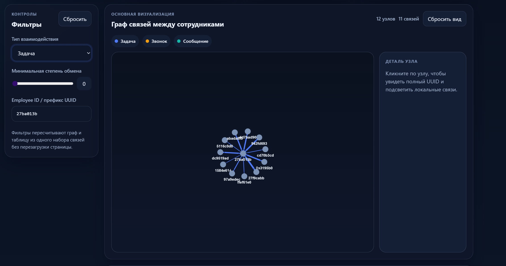
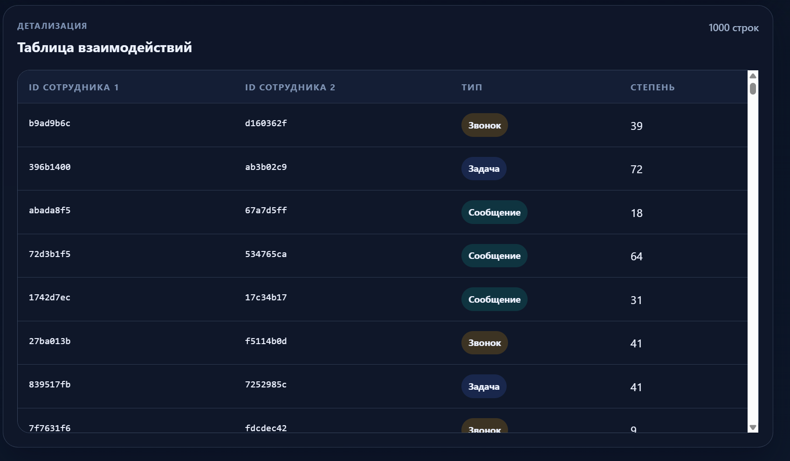

# Employee Communication Dashboard

Веб-приложение для визуализации взаимодействий между сотрудниками на основе CSV-источника. Интерфейс объединяет сводные метрики, интерактивный граф связей, фильтры и табличное представление, чтобы быстро просматривать структуру коммуникаций и детализировать отдельные связи.

## Демо

[](https://employers-communication-dashboard.vercel.app/)

Демо: https://employers-communication-dashboard.vercel.app/

---

## Обзор проекта

Дашборд состоит из четырех основных частей:

- сводные метрики по набору данных: количество сотрудников, количество взаимодействий, средняя сила связи и доминирующий тип
- интерактивный граф связей между сотрудниками с выделением соседних узлов и локальных ребер
- панель фильтров по типу взаимодействия, минимальной силе связи и префиксу employee ID
- таблица взаимодействий, синхронизированная с активными фильтрами

Визуально граф и таблица работают от одного и того же набора отфильтрованных данных. Это позволяет сначала сузить выборку через фильтры, затем посмотреть структуру связей на графе и при необходимости перейти к деталям в таблице и карточке выбранного узла.

---



<p align="center"><b>Рис. 1 — Главная страница системы</b></p>

Стартовый экран объединяет сводные показатели, панель фильтров, граф связей и табличное представление в одном рабочем пространстве.

---



<p align="center"><b>Рис. 2 — Граф взаимодействий сотрудников</b></p>

Основной графовый блок показывает структуру связей между сотрудниками и позволяет сразу перейти к деталям через выбор узла.

---

### Главный экран


<p align="center"><b>Рис. 3 — Главный экран дашборда</b></p>

Главный экран показывает полную компоновку интерфейса: статус API, сводные метрики, фильтры, граф и таблицу в пределах одной страницы.

---


<p align="center"><b>Рис. 4 — Блок сводных метрик</b></p>

Карточки summary позволяют быстро оценить состав набора данных и доминирующий тип взаимодействий без перехода к графу или таблице.

---

### Граф связей


<p align="center"><b>Рис. 5 — Основной блок графа и таблицы</b></p>

Граф используется для чтения структуры связей, а таблица ниже помогает сразу сопоставить визуальные связи с конкретными строками данных.

---



<p align="center"><b>Рис. 6 — Выбор узла на графе</b></p>

При выборе сотрудника подсвечиваются связанные узлы и рёбра, а правая карточка показывает UUID, degree и количество соседних узлов.

---



<p align="center"><b>Рис. 7 — Фильтрация по типу «задача»</b></p>

Фильтр по типу взаимодействия помогает выделить только задачи и посмотреть структуру связей без смешивания с другими каналами коммуникации.

---



<p align="center"><b>Рис. 8 — Фильтрация по типу «сообщение»</b></p>

Этот режим удобен для сравнения текстовых коммуникаций с другими типами взаимодействий и анализа плотности сетевых связей.

---



<p align="center"><b>Рис. 9 — Фильтрация по типу «звонок»</b></p>

Фильтрация по звонкам выделяет отдельный слой голосовых взаимодействий и упрощает анализ менее частых, но значимых связей.

---

### Фильтры и детализация



<p align="center"><b>Рис. 10 — Фильтрация по префиксу employee ID и выбранный узел</b></p>

Поиск по префиксу UUID сокращает граф до нужного фрагмента и позволяет быстро перейти к разбору конкретного сотрудника.

---



<p align="center"><b>Рис. 11 — Граф после фильтрации по employee ID</b></p>

Такой режим полезен для локального анализа связей вокруг одного сотрудника или группы сотрудников с общим префиксом идентификатора.

---



<p align="center"><b>Рис. 12 — Таблица взаимодействий</b></p>

Таблица показывает те же записи, что участвуют в построении графа, и используется для точной проверки строк и значений `interaction_strength`.

---

## Стек и архитектура

### Технологии

- backend: Python, FastAPI, pandas
- frontend: React, Vite, TypeScript
- визуализация графа: `react-force-graph-2d`
- стили: CSS
- источник данных: локальный CSV-файл `backend/data/employee_communication.csv`

---

### Как устроено приложение

- backend читает CSV, нормализует поля, считает агрегаты и отдает JSON через `/api`
- frontend получает summary и interactions, применяет фильтры на клиенте и строит графовые данные для визуализации
- граф и таблица используют одну и ту же отфильтрованную выборку, поэтому интерфейс остается согласованным

---

### Поток данных

---

```text
CSV -> FastAPI + pandas -> JSON API -> React -> filters -> graphData -> graph + table
```

### Структура проекта

```text
.
├── api/
│   └── index.py
├── backend/
│   ├── app/
│   │   ├── api/routes.py
│   │   ├── main.py
│   │   ├── schemas.py
│   │   ├── service.py
│   │   └── utils.py
│   └── data/employee_communication.csv
├── frontend/
│   ├── src/
│   │   ├── components/
│   │   │   ├── FiltersPanel.tsx
│   │   │   ├── GraphView.tsx
│   │   │   ├── Header.tsx
│   │   │   ├── InteractionTable.tsx
│   │   │   └── SummaryCards.tsx
│   │   ├── api.ts
│   │   ├── App.tsx
│   │   ├── interactionTheme.ts
│   │   ├── styles.css
│   │   └── types.ts
│   └── package.json
├── images/
├── public/
└── vercel.json
```

---

## Как запустить локально

### 1. Клонировать репозиторий

```bash
git clone https://github.com/forit-tech/employersCommunication-dashboard.git
cd employersCommunication-dashboard
```

### 2. Запустить backend

```bash
cd backend
python -m venv .venv
```

Windows PowerShell:

```bash
.venv\Scripts\Activate.ps1
```

macOS / Linux:

```bash
source .venv/bin/activate
```

Установка зависимостей и запуск:

```bash
pip install -r requirements.txt
uvicorn app.main:app --reload
```

Backend будет доступен по адресу `http://localhost:8000`.

### 3. Запустить frontend

В отдельном терминале:

```bash
cd frontend
npm install
npm run dev
```

Frontend будет доступен по адресу `http://localhost:5173`.

По умолчанию в режиме разработки frontend обращается к локальному API `http://localhost:8000/api`.

---

## Деплой

Production-версия опубликована на Vercel и доступна по ссылке:

https://employers-communication-dashboard.vercel.app/

Конфигурация деплоя описана в `vercel.json`: frontend собирается в `public`, а backend подключается как serverless API через `api/index.py`.
